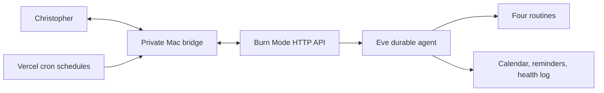

# Burn Mode

Burn Mode is Christopher Burns' private Eve agent: his personal version of Founder Mode and a decisive external executive-function layer for routine, health, accountability, and founder work. It reduces choices, challenges reflexive delay, turns overwhelm into one physical next action, and resets without shame.

## What is included

- An always-on Burn Mode identity and safety/privacy rules.
- Four on-demand routines: morning check-in, making the Burn Mode choice, planning the day, and evening reset.
- Typed reminder, calendar, and health-log tools with bounded inputs and outputs.
- Private bridge authentication, request timeouts, response validation, and idempotency for writes.
- Proactive check-ins at 05:00, 08:30, and 20:45 Europe/London, including GMT/BST handling.
- A private HTTP channel for local use, same-project Vercel callers, and trusted Basic-auth clients.
- A reduced Eve tool surface: no shell, filesystem, arbitrary web access, or generic todo tool.

The Apple/iMessage bridge is intentionally a separate trusted process on a Mac. This repository contains its narrow API contract, not a process that reads a Messages database or gains broad access to personal conversations.



## Run locally

Eve requires Node 24 and a model credential.

```bash
cp .env.example .env.local
# Set AI_GATEWAY_API_KEY in .env.local, or link a Vercel project:
npm exec -- eve link

npm run check
npm run dev
```

`npm run dev` opens Eve's terminal UI. Local loopback requests are admitted by Eve's development authenticator. The agent remains conversationally useful without the Mac bridge; bridge-backed actions return a clear `bridge_unconfigured` result until both bridge variables are set.

## Private bridge contract

Set:

```dotenv
BURN_MODE_BRIDGE_URL=https://your-private-bridge.example
BURN_MODE_BRIDGE_TOKEN=use-a-long-random-secret
```

Every request carries `Authorization: Bearer <BURN_MODE_BRIDGE_TOKEN>`, requests JSON, rejects redirects, and times out after 10 seconds. Write requests also carry an `Idempotency-Key`. The bridge must authenticate with a constant-time secret comparison, deduplicate idempotency keys, return JSON, and never treat body-supplied identity as trusted.

The supported endpoints are:

| Method and path | Purpose | Success response |
| --- | --- | --- |
| `GET /v1/reminders` | List bounded reminders | `{ "reminders": [...] }` |
| `POST /v1/reminders` | Create a reminder | `{ "reminder": {...} }` |
| `POST /v1/reminders/:id/complete` | Complete a reminder | `{ "reminder": {...} }` |
| `GET /v1/calendar/blocks` | List bounded calendar blocks | `{ "blocks": [...] }` |
| `POST /v1/calendar/blocks` | Create a block with no attendees | `{ "block": {...} }` |
| `GET /v1/health-logs` | List self-reported observations | `{ "logs": [...] }` |
| `POST /v1/health-logs` | Append a factual observation | `{ "log": {...} }` |
| `POST /v1/messages` | Send a proactive Burn Mode message | `{ "accepted": true }` |

Dates are ISO 8601 strings with an explicit offset. The exact schemas, limits, and query fields are the Zod definitions in `agent/tools/` and `agent/lib/bridge-client.ts`; those files are the protocol source of truth.

For local development the bridge URL can be loopback. A Vercel deployment cannot reach a service bound only to the Mac's localhost, so production needs a mutually trusted HTTPS route to the Mac bridge or a later polling/queue adapter. Do not expose the bridge without authentication.

## Scheduled rhythm

Vercel evaluates cron in UTC. Each schedule therefore runs at the two possible GMT/BST UTC hours and sends only when an `Intl.DateTimeFormat` check matches the intended Europe/London time:

- 05:00 — “Burn Mode active. Water. Stretch. Shoes on. No notifications.”
- 08:30 — “What are the three things that would make today count?”
- 20:45 — wind-down and prepare tomorrow.

Every scheduled message uses `schedule:<name>:<London-date>` as its idempotency key. The bridge must treat a repeated key as the same delivery, since hosted cron and network retries are at-least-once.

## Deploy on Vercel

Configure `BURN_MODE_USERNAME`, `BURN_MODE_PASSWORD`, `BURN_MODE_BRIDGE_URL`, and `BURN_MODE_BRIDGE_TOKEN` in the Vercel project, then:

```bash
npm exec -- eve link
npm exec -- eve deploy
```

Gateway model IDs authenticate through Vercel OIDC on a linked deployment. The HTTP API admits valid same-project Vercel OIDC, loopback development, or the configured Basic credentials; it has no anonymous production fallback.

Use the Basic credentials only in trusted clients such as the Mac bridge. Give Burn Mode its own iMessage conversation or number and forward only messages deliberately addressed to it—never ingest the full Messages history.

## Safety boundary

Burn Mode supports habits and practical organisation; it does not diagnose, alter medication, replace professional care, or prescribe extreme diet, exercise, or sleep restriction. Calendar and reminder writes and health-log appends require user approval in an interactive Eve session. The bridge tools do not delete events or records, invite attendees, send arbitrary messages, or make purchases.
