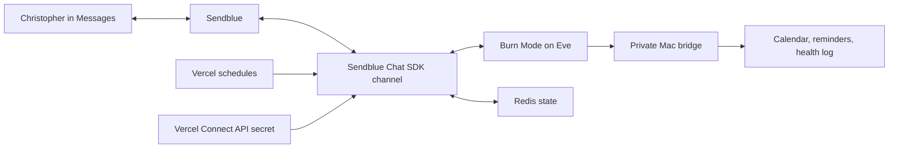

# Burn Mode

Burn Mode is Christopher Burns' private Eve agent: a personal version of Founder Mode and an external executive-function layer for routine, health, accountability, and founder work. It reduces choices, challenges reflexive delay, turns overwhelm into one physical next action, and resets without shame.

It now talks through iMessage, SMS, or RCS using Sendblue. Only Christopher's configured phone number is accepted.

## What is included

- An always-on Burn Mode identity and safety/privacy rules.
- Four routines: morning check-in, making the Burn Mode choice, planning the day, and evening reset.
- A Sendblue Chat SDK channel at `POST /eve/v1/sendblue`.
- One-response-per-turn delivery because iMessage cannot edit a delivered message.
- Text-based Eve approvals and questions: reply with `approve`, `deny`, an option name, or its number. Multiple requests require one indexed answer per line.
- A strict E.164 sender/line allowlist applied before Chat persistence, plus timing-safe Sendblue webhook-secret verification before any Connect lookup.
- Durable, environment-namespaced Redis state for webhook deduplication, rapid-message queues, pending multi-approvals, opt-out state, scheduled-delivery claims, and check-in context.
- Proactive check-ins at 05:00, 08:30, and 20:45 Europe/London, including GMT/BST handling.
- Typed reminder, calendar, and health-log tools through a separate, narrow Mac bridge.
- A private Eve HTTP channel for local development and trusted clients.
- No shell, filesystem, arbitrary web access, or generic todo tool.



## Run locally

Eve requires Node 24 and a model credential.

```bash
cp .env.example .env.local
# Set AI_GATEWAY_API_KEY, or link a Vercel project:
npm exec -- eve link

npm run check
npm run dev
```

The Eve terminal UI works without Sendblue configured. To exercise the Sendblue webhook locally, set `SENDBLUE_API_KEY`, `SENDBLUE_API_SECRET`, `SENDBLUE_FROM_NUMBER`, `SENDBLUE_WEBHOOK_SECRET`, and `BURN_MODE_PHONE_NUMBER`. `SENDBLUE_API_SECRET` is only the local fallback; production resolves it from Vercel Connect.

## Configure Sendblue and Vercel Connect

Create one API-key connector containing the **Sendblue API secret**. The Sendblue API key ID remains in encrypted project environment configuration because an API-key connector issues one token value.

The Vercel dashboard is the simplest path. The equivalent CLI flow keeps the secret out of the command arguments and shell history:

```bash
read -rs "secret?Sendblue API secret: "
echo
SENDBLUE_SECRET="$secret" node -e \
  'process.stdout.write(JSON.stringify({values:[{value:process.env.SENDBLUE_SECRET}]}))' \
  | vercel connect create sendblue \
      --name burn-mode-sendblue \
      --connector-type api-key \
      --data @- \
      --format=json
unset secret
```

Copy the exact `uid` returned by the command, link the Eve project, and attach the connector to production without webhook triggers:

```bash
npm exec -- eve link
vercel connect attach <returned-connector-uid> \
  --environment production
```

Use separate Sendblue credentials and a separate connector if previews need messaging access. Sendblue itself posts directly to Burn Mode, so this generic connector gates runtime access to the static provider secret; Vercel Connect trigger forwarding is not used. The adapter caches that secret for one warm process, so redeploy after rotating the connector value.

Configure these project variables:

| Variable | Purpose |
| --- | --- |
| `SENDBLUE_CONNECTOR_UID` | Exact connector UID returned by Vercel; required on hosted production/preview deployments |
| `SENDBLUE_API_KEY` | Sendblue API key ID |
| `SENDBLUE_FROM_NUMBER` | Assigned Sendblue line in E.164 format |
| `SENDBLUE_WEBHOOK_SECRET` | Long random shared secret, at least 16 characters |
| `BURN_MODE_PHONE_NUMBER` | Christopher's exact E.164 number; every other sender is ignored |
| `REDIS_URL` | Persistent Redis-compatible connection URL; required on hosted Vercel environments |

Generate a webhook secret with `openssl rand -hex 32`. After deploying, configure Sendblue's receive webhook as:

```text
https://YOUR_DEPLOYMENT/eve/v1/sendblue
```

Configure Sendblue to send the matching value in the `sb-signing-secret` header. The route validates that secret locally, then accepts only one-to-one traffic between `SENDBLUE_FROM_NUMBER` and `BURN_MODE_PHONE_NUMBER`; other senders, lines, and groups are acknowledged without entering Chat history. It does not use the Basic credentials for the separate Eve HTTP channel.

Carrier opt-out words such as `STOP`, `CANCEL`, and `UNSUBSCRIBE` disable scheduled messages in Redis and are not forwarded to Eve. A later `START` or `UNSTOP` clears that local flag once Sendblue reports the number as opted in again.

## Scheduled rhythm

Vercel evaluates cron in UTC. Each schedule runs at the two possible GMT/BST UTC hours and sends only when an `Intl.DateTimeFormat` check matches the intended Europe/London time:

- 05:00 — “Burn Mode active. Water. Stretch. Shoes on. No notifications.”
- 08:30 — “What are the three things that would make today count?”
- 20:45 — wind down and prepare tomorrow.

Each schedule posts the exact text directly through Sendblue, so it is not delayed by an unrelated Eve approval that is waiting for Christopher. Redis stores the check-in as context for the next reply, allowing Eve to understand answers such as `done` or a list of three priorities. It also claims `schedule:<name>:<London-date>` before delivery. That claim is deliberately retained after an attempt—even after an ambiguous provider failure—to avoid duplicate texts from hosted cron retries; a missed check-in must be retried manually.

## Optional Mac bridge

The Mac bridge is no longer responsible for iMessage. It remains a deliberately narrow boundary for Calendar, Reminders, and self-reported health observations.

```dotenv
BURN_MODE_BRIDGE_URL=https://your-private-bridge.example
BURN_MODE_BRIDGE_TOKEN=use-a-long-random-secret
```

Every request carries `Authorization: Bearer <BURN_MODE_BRIDGE_TOKEN>`, requests JSON, rejects redirects, and times out after 10 seconds. Write requests carry an `Idempotency-Key`. The bridge must authenticate with a timing-safe secret comparison, deduplicate idempotency keys, return JSON, and never trust a body-supplied identity.

| Method and path | Purpose | Success response |
| --- | --- | --- |
| `GET /v1/reminders` | List bounded reminders | `{ "reminders": [...] }` |
| `POST /v1/reminders` | Create a reminder | `{ "reminder": {...} }` |
| `POST /v1/reminders/:id/complete` | Complete a reminder | `{ "reminder": {...} }` |
| `GET /v1/calendar/blocks` | List bounded calendar blocks | `{ "blocks": [...] }` |
| `POST /v1/calendar/blocks` | Create a block with no attendees | `{ "block": {...} }` |
| `GET /v1/health-logs` | List self-reported observations | `{ "logs": [...] }` |
| `POST /v1/health-logs` | Append a factual observation | `{ "log": {...} }` |

Dates are ISO 8601 strings with an explicit offset. The Zod definitions in `agent/tools/` and `agent/lib/bridge-client.ts` are the protocol source of truth. A Vercel deployment cannot reach a service bound only to the Mac's localhost; production needs a mutually trusted HTTPS route.

## Deploy

With the connector attached and all production variables configured:

```bash
npm run check
npm exec -- eve deploy
```

Gateway model IDs authenticate through Vercel OIDC on a linked deployment. The separate Eve HTTP API admits valid same-project Vercel OIDC, loopback development, or configured Basic credentials; it has no anonymous production fallback.

## Safety boundary

Burn Mode supports habits and practical organisation. It does not diagnose, alter medication, replace professional care, or prescribe extreme diet, exercise, or sleep restriction. Calendar and reminder writes and health-log appends require Christopher's approval. The bridge tools do not delete events or records, invite attendees, send arbitrary messages, or make purchases.
